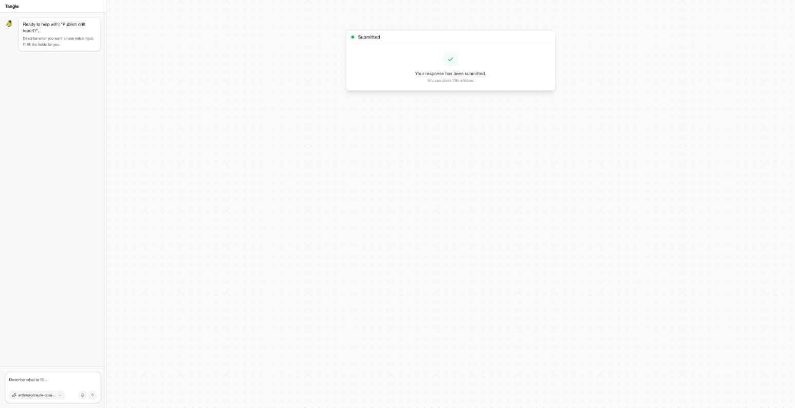

# Weft, field-tested: the first external port of a governed pipeline

**[Weft](https://github.com/WeaveMindAI/weft)** is a new open-source coordination language
for AI systems — LLMs, humans, APIs, and infrastructure as typed nodes in a
compiler-verified graph, pre-release as of this writing. In one overnight session
(2026-08-18) I ported a real governance pipeline to it, compiled it on the `mvp` branch,
fought a local Kubernetes runtime, ran it **end to end on WeaveMind Cloud**, and evaluated
the language against its own published claims — including shipping a working patch for its
biggest unshipped one.

The port: a **governance drift researcher** — scans vendor model-lifecycle data and an
observed agent tenant against an approved baseline, attaches verifiable evidence (source,
field path, content hash) to every finding, drops anything it can't re-verify, enriches
with literature via Semantic Scholar, drafts a report with an LLM, and **publishes nothing
until a human approves**. ~20 nodes. It ran; a human (me, at 3 AM) clicked approve; the
gate passed.

## The five-minute version

| Claim | Verdict |
|---|---|
| "The compiler catches wrong types, missing connections, broken logic" | **True, and better than PoC-grade.** 13 validation passes; caught a real union-type bug in this port on first compile that the original Python would have hit at runtime. |
| "The compiler won't let the AI send unfiltered user input straight into a model" | **Not implemented** — no taint machinery exists in any branch. But the shipped declarative rule grammar can express a first version: [this ~30-line metadata patch](eval/unfiltered-prompt-rule.patch) makes the compiler refuse my unfiltered web-text → LLM edge and admit the moderated one. [Transcripts](eval/transcript-rule-firing.txt). |
| "Edit either view, the other updates" | True in the editor — but the Cloud *compiler* rejects syntax the editor parser accepts, discovered at run start. Three dialects currently coexist (main, mvp, Cloud). |
| "Your program is a native binary, not a graph being interpreted" | Half-true: node implementations are natively compiled; the topology is JSON, fetched per execution and walked by an engine inside that binary. |
| Durable execution / human-in-the-loop | The suspension survived everything we threw at it, and on Cloud the approval is **structurally human** — no API in the product surface lets the agent that built the project approve its own report. That's "agents propose, humans promote" enforced by the runtime. |

Also in here: a poisoned terminate-sweep that survives dispatcher restarts (durable state
cutting both ways), why the platform doesn't fit Docker Desktop's default VM, and the
undocumented enterprise story hiding in `weft new`'s per-project catalog vendoring —
governance policy distributed with the vocabulary.

## Read the full thing

- **[EVALUATION.md](EVALUATION.md)** — the complete evaluation: compile layer, local
  runtime attempt (four findings), and the Cloud run (four more).
- **[UPSTREAM-REPORT.md](UPSTREAM-REPORT.md)** — the field report prepared for the
  WeaveMind team, ordered strengths-first.
- **[main.weft](main.weft)** — the moderated pipeline (mvp dialect);
  [main.run-variant.weft](main.run-variant.weft) is the local-run variant.
- **[eval/](eval/)** — the rule patch and reproduction transcripts.

## Method, stated

Everything here follows one discipline: claims carry evidence (file:line citations,
committed transcripts, screenshots of live runs), failures are reported with root causes
rather than hidden, and the subject is measured against **its own** published claims and
design principles — including its stated author model, "the author is an AI with a prompt,"
which is literally how this port was written. The evaluation praises what's real, patches
what's missing where the machinery allows, and states precisely the distance between the
demo and the promise.

*Weft is O'Saasy-licensed; its catalog is deliberately not vendored here — `weft new`
regenerates it, and the one-file rule change ships as a patch instead.*
